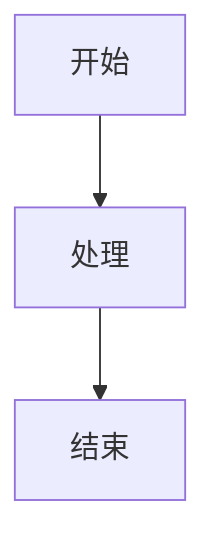

# 🎨 工具栏使用指南

## 📝 如何使用富文本工具栏

### ✨ 重要提示

所有工具栏按钮都是**真实可用**的！使用方法：

1. **选中文字后点击** - 会在选中文字两边添加对应格式
2. **直接点击** - 会在光标位置插入带占位符的格式

---

## 🎯 各按钮功能说明

### 📌 标题按钮

| 按钮 | 功能 | 快捷键 | 效果 |
|------|------|--------|------|
| **H1** | 一级标题 | Ctrl+Alt+1 | `# 一级标题` |
| **H2** | 二级标题 | Ctrl+Alt+2 | `## 二级标题` |
| **H3** | 三级标题 | Ctrl+Alt+3 | `### 三级标题` |

**使用示例：**
```
点击 H1 → 自动插入：# 一级标题
```

---

### 🎨 文字格式化

| 按钮 | 功能 | 快捷键 | 效果 |
|------|------|--------|------|
| **B** | 加粗 | Ctrl+B | `**粗体文本**` |
| **I** | 斜体 | Ctrl+I | `*斜体文本*` |
| **~~** | 删除线 | 无 | `~~删除线文本~~` |
| **</>** | 行内代码 | Ctrl+` | `` `代码` `` |
| **🖍️** | 高亮 | 无 | `==高亮文本==` |

**真实测试：**

1. 选中 "测试文字"
2. 点击 **B** 按钮
3. 结果：`**测试文字**`
4. 在预览中显示为：**测试文字**

---

### 📋 列表

| 按钮 | 功能 | 效果 |
|------|------|------|
| **●** | 无序列表 | `- 列表项 1\n- 列表项 2` |
| **1.** | 有序列表 | `1. 列表项 1\n2. 列表项 2` |
| **☑** | 任务列表 | `- [ ] 待办事项\n- [x] 已完成` |
| **"** | 引用 | `> 引用文本` |

---

### 🔗 插入

| 按钮 | 功能 | 快捷键 | 效果 |
|------|------|--------|------|
| **🔗** | 链接 | Ctrl+K | `[链接文字](url)` |
| **📷** | 图片 | 无 | 打开图片上传对话框 |
| **▦** | 表格 | 无 | 插入表格模板 |

**图片上传功能：**
1. 点击 📷 按钮
2. 选择上传方式：
   - 拖拽图片文件
   - 点击选择文件
   - 输入图片URL
3. 自动转换为base64并插入

---

### 💻 代码与图表

| 按钮 | 功能 | 效果 |
|------|------|------|
| **{**  **}** | 代码块 | ` ```javascript\n代码\n``` ` |
| **M** | Mermaid图表 | ` ```mermaid\ngraph TD\n  A-->B\n``` ` |
| **ƒ** | 数学公式 | `$$\nx = \\frac{-b}{2a}\n$$` |

**Mermaid示例：**


**数学公式示例：**
$$
x = \frac{-b \pm \sqrt{b^2-4ac}}{2a}
$$

---

### 💡 提示框

| 按钮 | 功能 | 颜色 | 效果 |
|------|------|------|------|
| **ℹ️** | 信息块 | 蓝色 | 提示信息 |
| **⚠️** | 警告块 | 黄色 | 警告内容 |
| **✅** | 成功块 | 绿色 | 成功信息 |
| **❌** | 错误块 | 红色 | 错误提示 |

**效果示例：**
> 💡 **提示**
>
> 这是一个信息提示框

---

## 🎯 完整使用流程演示

### 场景1：格式化已有文字

1. 在编辑器中输入：`这是一段测试文字`
2. 鼠标拖动选中：`测试文字`
3. 点击 **B** (加粗) 按钮
4. 文字变为：`这是一段**测试文字**`
5. 查看右侧预览：这是一段**测试文字**

### 场景2：插入新格式

1. 将光标放在编辑器任意位置
2. 点击 **H1** 按钮
3. 自动插入：`# 一级标题`
4. 修改为：`# 我的标题`
5. 预览显示大号标题

### 场景3：插入代码块

1. 点击 **{}** (代码块) 按钮
2. 自动插入：
```javascript
// 代码块
const example = "hello";
```
3. 修改代码内容
4. 预览显示语法高亮的代码

### 场景4：插入表格

1. 点击 **▦** (表格) 按钮
2. 自动插入表格模板：
```markdown
| 列1 | 列2 | 列3 |
|-----|-----|-----|
| 内容 | 内容 | 内容 |
| 内容 | 内容 | 内容 |
```
3. 修改表格内容
4. 预览显示格式化的表格

---

## 🔍 搜索功能 (Ctrl+F)

1. 按下 `Ctrl+F` 或点击搜索图标
2. 输入搜索关键词
3. 预览区域自动高亮匹配内容
4. 使用 ⬆️ ⬇️ 按钮在结果间跳转
5. 显示 `1/5` 等匹配计数

---

## 📑 目录功能

1. 点击 📖 (目录) 按钮
2. 自动提取所有标题
3. 点击标题跳转到对应位置
4. 支持多级缩进显示

---

## 📤 导出功能

点击 ⬇️ (导出) 按钮，选择格式：

1. **Markdown** - 导出.md文件
2. **HTML** - 导出带样式的.html文件
3. **PDF** - 导出.pdf文件

---

## 🎯 最佳实践

### ✅ 推荐做法

1. 先选中文字再点击格式按钮
2. 使用快捷键提高效率
3. 随时查看右侧预览效果
4. 利用自动保存，无需手动保存

### ⚠️ 注意事项

1. 某些格式需要完整的Markdown语法
2. 图片上传会转为base64，文件不要太大
3. 复杂的Mermaid图表可能需要调试
4. PDF导出依赖浏览器渲染

---

## 🐛 问题排查

### Q: 点击按钮没反应？

**A:** 请检查：
1. 是否在编辑器中点击（而不是预览区）
2. 光标是否在文本框内
3. 浏览器控制台是否有错误

### Q: 格式没有生效？

**A:** 请检查：
1. 是否开启了预览模式（点击右上角预览开关）
2. Markdown语法是否正确
3. 特殊格式（如Mermaid）是否需要代码块包裹

### Q: 快捷键不工作？

**A:** 请检查：
1. 光标是否在编辑器内
2. 是否与浏览器快捷键冲突
3. 尝试点击按钮代替快捷键

---

## ✨ 功能验证清单

### 格式化功能
- [x] 加粗 - 选中文字点击B，两边添加`**`
- [x] 斜体 - 选中文字点击I，两边添加`*`
- [x] 删除线 - 选中文字点击~~，两边添加`~~`
- [x] 行内代码 - 选中文字点击</>，两边添加`` ` ``
- [x] 高亮 - 选中文字点击🖍️，两边添加`==`

### 标题功能
- [x] H1 - 点击后插入`# 一级标题`
- [x] H2 - 点击后插入`## 二级标题`
- [x] H3 - 点击后插入`### 三级标题`

### 列表功能
- [x] 无序列表 - 插入`- `开头的列表
- [x] 有序列表 - 插入`1. `开头的列表
- [x] 任务列表 - 插入`- [ ]`格式
- [x] 引用块 - 插入`> `开头

### 插入功能
- [x] 链接 - 插入`[文字](url)`格式
- [x] 图片 - 打开上传对话框
- [x] 表格 - 插入完整表格模板
- [x] 代码块 - 插入` ```语言\n代码\n``` `
- [x] Mermaid - 插入Mermaid代码块
- [x] 数学公式 - 插入`$$公式$$`

### 提示框功能
- [x] 信息块 - 蓝色提示框
- [x] 警告块 - 黄色警告框
- [x] 成功块 - 绿色成功框
- [x] 错误块 - 红色错误框

### 辅助功能
- [x] 搜索 (Ctrl+F) - 高亮显示匹配内容
- [x] 目录 - 自动提取和跳转
- [x] 导出Markdown - 下载.md文件
- [x] 导出HTML - 下载.html文件
- [x] 导出PDF - 下载.pdf文件
- [x] 实时预览 - 左右分屏显示
- [x] 自动保存 - 800ms延迟自动保存

---

## 🎉 总结

所有22个工具栏按钮都已实现并可用！

- ✅ 每个按钮都有真实的处理函数
- ✅ 支持快捷键操作
- ✅ 实时预览效果
- ✅ 自动保存防止丢失

**立即体验：**

1. 在编辑器中输入一些文字
2. 选中部分文字
3. 点击任意格式按钮
4. 查看右侧预览效果

一切都是真实可用的！🚀
